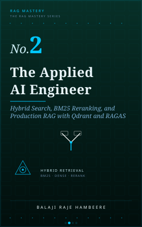

<div align="center">



# The Applied AI Engineer — Hybrid Search & Production RAG in Python (Qdrant + BM25 + Cross-Encoder Reranking)

**ShopBot v2**: the production upgrade of an open-source Retrieval-Augmented Generation (RAG) chatbot — the complete companion codebase for *The Applied AI Engineer*, Book 2 of the [Zudyog RAG Mastery Series](https://www.zudyog.com/).

### 📖 Every line of this code is explained, chapter by chapter, in the book.

[](https://www.zudyog.com/books/the-applied-ai-engineer)

This repo shows you *what* was built. The book shows you *why* — every design decision, every dead end, every real evaluation score, written as the chapters that produced this exact code.

[](https://www.python.org/)
[](https://fastapi.tiangolo.com/)
[](https://qdrant.tech/)
[](https://redis.io/)
[](https://github.com/explodinggradients/ragas)
[](https://mlflow.org/)
[](https://www.docker.com/)
[](https://nextjs.org/)

📖 [Read the book](https://www.zudyog.com/books/the-applied-ai-engineer) · 🌐 [zudyog.com](https://www.zudyog.com/) · 🐛 [Report an issue](https://github.com/zudyog/the-applied-ai-engineer/issues) · ⭐ Star this repo if it helped you

</div>

---

## What this is

This repository is the real, working codebase behind **ShopBot v2** — the same RAG product assistant for **zUdyog Fashion** from Book 1, rebuilt to close the failure modes Book 1's own evaluation surfaced. Book 1 proved the Grounding Layer works. Book 2 is where that architecture gets pushed until it breaks, then rebuilt piece by piece: hybrid retrieval, cross-encoder reranking, conversation memory, a three-layer cache, and a 4-dimension RAGAS evaluation harness with real production concerns — a standalone rerank microservice, load testing, MLflow request tracing.

If you're searching for a **hybrid search (dense + BM25) RAG example in Python**, a **Qdrant migration from ChromaDB**, a **cross-encoder reranking microservice**, a **Redis-backed conversation memory pattern for RAG**, or a working **4-dimension RAGAS evaluation harness (Faithfulness, Answer Relevance, Context Precision, Context Recall)**, this repository is a complete, runnable reference implementation.

## Why this project exists

Book 1 shipped a working RAG pipeline and measured it honestly — Faithfulness 0.7494, Context Precision 0.6417 on a 20-query RAGAS baseline. Good enough to ship, not good enough to trust with real traffic. This project starts from that exact baseline and closes the gap it exposed:

- **The 22% problem** — roughly 22 of every 100 queries failed for two specific, diagnosable reasons: SKU/style codes carry no semantic meaning in embedding space, and multi-intent queries ("something festive *and* warm") can't be served by a single retrieval vector.
- **Vocabulary gaps close with hybrid search, not bigger embeddings** — BM25 sparse retrieval fused with dense search (Reciprocal Rank Fusion) catches literal SKU lookups that cosine similarity alone misses.
- **A second-pass reranker outperforms a single retrieval score** — a cross-encoder rereads query and candidate together, sorting out what a bi-encoder's cosine similarity can't.
- **Conversation shouldn't reset every message** — Redis-backed session memory (last 3 turns, rolling summary, active SKUs) makes "What about size L?" resolve correctly without the customer repeating the product name.
- **Caching a RAG pipeline isn't a simple key-value problem** — a three-layer cache (exact → semantic ≥0.97 cosine → full pipeline) has to know when a query is context-dependent and skip caching entirely rather than serve another session's answer.
- **Production means someone else has to run this too** — the cross-encoder is split into its own Docker microservice so it scales independently of the API, with load-test findings to back the claim.

## Architecture

This codebase is split into **four standalone projects** — a deliberate change from Book 1's single `shopbot/` directory. Each project below shares no code and no dependencies with its siblings; they communicate only over HTTP or through the Qdrant collection one writes and the others read.

```
shopbot/shopbot-ingest/   ← Build-time: chunk + embed + write catalog to Qdrant   (no server)
shopbot/shopbot-agent/     ← FastAPI RAG backend — the /ask endpoint              (port 8000)
shopbot/shopbot-rerank/     ← Cross-encoder reranking microservice, standalone    (port 8001)
shopbot/zudyog-fashion/      ← Next.js storefront + AI chat widget                (port 3000)
```

**Request-time pipeline** (`shopbot-agent`, every `/ask` call):

```
POST /ask  (Pydantic-validated input)
      │
      ▼
Session memory load (Redis) — recent turns, rolling summary, active SKUs
      │
      ▼
Three-layer cache — exact match → semantic (≥0.97 cosine) → full pipeline
      │  (cache miss ~78% of traffic)
      ▼
Query decomposition — 1 or 2 intents detected (gpt-4o-mini)
      │
      ▼
Hybrid retrieval per sub-query — dense (Qdrant) + BM25, merged by RRF (k=60)
      │
      ▼
Cross-encoder rerank (HTTP → shopbot-rerank) — top-20 → top-3, confidence floor 0.55
      │
      ▼
Grounded prompt (evidence + question + conversation context) → gpt-4o-mini @ temp 0
      │
      ▼
Answer — cache write, session update, traced to MLflow
```

## Tech stack

| Layer | Technology |
| --- | --- |
| Backend API | Python, FastAPI, Pydantic, Uvicorn |
| Vector database | Qdrant Cloud (dense + BM25 sparse, hybrid via RRF) — migrated from Book 1's ChromaDB |
| Reranking | `cross-encoder/ms-marco-MiniLM-L-6-v2`, isolated in its own Docker microservice |
| Conversation memory & cache | Redis (session state, three-layer answer cache, pub-sub invalidation) |
| Embeddings & LLM | OpenAI `text-embedding-3-small`, `gpt-4o-mini` |
| Evaluation | RAGAS — Faithfulness, Answer Relevance, Context Precision, Context Recall |
| Experiment tracking | MLflow (PostgreSQL + Docker Compose), request tracing via `mlflow.openai.autolog()` |
| Frontend | Next.js, React, Tailwind CSS |
| Deployment | Railway (backend + rerank service), Vercel (frontend) |

## Quickstart

```bash
# 1 — Build the catalog (once; re-run whenever the product data changes)
cd shopbot/shopbot-ingest
python -m venv venv && source venv/bin/activate && pip install -r requirements.txt
cp .env.example .env               # OPENAI_API_KEY, QDRANT_URL, QDRANT_API_KEY
python -m infra.qdrant_setup && python -m ingestion.dual_write && python -m ingestion.bm25_backfill

# 2 — Start the rerank microservice (required — no in-process fallback)
cd ../shopbot-rerank
docker build -t shopbot-rerank . && docker run -p 8001:8001 shopbot-rerank

# 3 — Start the backend (separate terminal)
cd ../shopbot-agent
python -m venv venv && source venv/bin/activate && pip install -r requirements.txt
cp .env.example .env               # + REDIS_URL, RERANK_URL=http://localhost:8001
python src/api.py                   # → http://localhost:8000/docs

# 4 — Start the frontend (separate terminal)
cd ../zudyog-fashion
npm install && npm run dev          # → http://localhost:3000
```

Each project's `.env.example` documents the environment variables it needs; the four steps above are the full run order end to end.

## What each chapter builds

| Chapter | What it builds in this repo |
| --- | --- |
| Preface | Diagnoses the 22%-failure baseline this whole codebase exists to close |
| 1 | Root-causes the two failure modes: vocabulary gaps (SKU codes) and multi-intent queries |
| 2 | Qdrant Cloud migration — dual-write from ChromaDB, shadow reads, uuid5 point IDs |
| 3 | Hybrid search — BM25 sparse + dense, fused with Reciprocal Rank Fusion (k=60) |
| 4 | Cross-encoder reranking — top-20 candidates down to a top-3 the LLM actually sees |
| 5 | Query decomposition — one query becomes two retrievals when it carries two intents |
| 6 | Redis session memory — recent turns, rolling summary, active-SKU boost |
| 7 | Three-layer answer cache — exact, semantic, and context-sensitive cache bypass |
| 8 | Full 4-dimension RAGAS evaluation harness + MLflow experiment tracking |
| 9 | Production concerns — the rerank microservice split, load testing, request tracing |
| Appendix A | Shared client wiring and the full project structure |

**Evaluation, honestly stated:** the architecture is calibrated against these Book 2 targets — Faithfulness 0.83, Answer Relevance 0.81, Context Precision 0.88, Context Recall 0.79 — up from Book 1's measured 0.7494 / — / 0.6417 / —. The labeled dataset driving Answer Relevance and Context Recall currently has 20 of a planned 100 queries, so those two numbers aren't statistically final yet.

## Repository structure

```
the-applied-ai-engineer/
└── shopbot/
    ├── shopbot-ingest/     # Build-time: chunker, embedder, Qdrant + BM25 writer
    ├── shopbot-agent/       # FastAPI backend: retrieval, memory, cache, evaluation, /ask
    ├── shopbot-rerank/       # Standalone cross-encoder microservice (Docker)
    ├── zudyog-fashion/        # Next.js storefront + chat widget
    └── costs/                  # OpenAI cost audit trail
```

## Who this is for

Developers and ML engineers who've already got a RAG pipeline working and are hitting its ceiling — the query that returns nothing because the SKU code doesn't embed, the two-part question that only gets half-answered, the customer who has to repeat themselves every turn. If you're evaluating **Qdrant vs. ChromaDB for hybrid search**, **when to add a cross-encoder reranker**, or **how to actually cache a RAG pipeline without serving stale or cross-session answers**, the working code and the book's reasoning behind every decision are both here.

## Related

This is Book 2 of the RAG Mastery series, continuing the exact ShopBot codebase from **Book 1, [*The AI Engineer*](https://www.zudyog.com/books/the-ai-engineer)** — free to read, and the place to start if you haven't built the Grounding Layer this book upgrades.

## Where the story goes next

<table>
<tr>
<td width="140" valign="top">

</td>
<td valign="top">

### Book 3 — [The Senior AI Engineer](https://www.zudyog.com/books/the-senior-ai-engineer)
**LangGraph, HyDE, CRAG, and Fine-Tuned Embeddings for Advanced RAG**

Every RAG system eventually meets its hard 9% — the ambiguous question, the query that needs two hops of reasoning, the retrieval that looked fine and was quietly wrong. That's the gap between a system you demo and a system you'd stake your name on. Book 3 is nine chapters on closing it: adaptive routing with LangGraph, HyDE for queries that don't match the vocabulary of your documents, Corrective RAG for catching retrieval failures before they become answers, and embedding models fine-tuned on your own domain instead of borrowed from someone else's.

</td>
</tr>
<tr>
<td width="140" valign="top">

</td>
<td valign="top">

### Book 4 — [The AI Solutions Architect](https://www.zudyog.com/books/the-ai-solutions-architect)
**Multi-Tenant RAG on AWS Bedrock with GDPR Compliance and Audit Trails**

There's a specific moment every founder building this hits: the first enterprise customer asks "can you guarantee my data never touches another tenant's index, and can you prove it in an audit?" Book 4 builds the Pramana Framework for every tenant you'll ever sign — per-tenant Qdrant collections, AWS Bedrock at scale, and GDPR-compliant deletion pipelines that hold up when someone actually asks you to produce the receipt.

</td>
</tr>
</table>

**[Book 1 is free.](https://www.zudyog.com/books/the-ai-engineer)** A subscription unlocks the full series, including this book. [See the full series →](https://www.zudyog.com/)

## About Zudyog

[**Zudyog**](https://www.zudyog.com/) publishes the **RAG Mastery Series** — 11 books on building production Retrieval-Augmented Generation systems, from first embeddings to cloud-native, multi-tenant agentic architectures. Four core books are available now (this one included); seven companion books release quarterly starting November 2026.

**Book 1 — *The AI Engineer* — is completely free to read** at [zudyog.com/books/the-ai-engineer](https://www.zudyog.com/books/the-ai-engineer). A subscription unlocks the full series, including this book's hybrid search, reranking, and production upgrade to that same codebase.

Every book in the series follows the same principle this repository demonstrates: real, runnable code and measured evaluation scores, not diagrams of an architecture that was never actually built.

## Contributing

Issues and pull requests are welcome — this is a living reference implementation, and reports of bugs, version mismatches, or unclear steps in the setup are genuinely useful. New to the codebase? **[CONTRIBUTING.md](CONTRIBUTING.md)** has a list of good-first-issue-sized gaps to start from.
